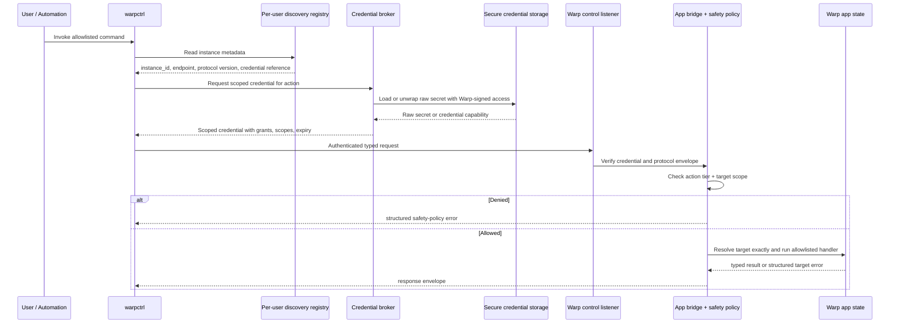

# warpctrl security architecture
`warpctrl` is a local-control CLI for an already-running Warp app instance. Its security architecture is designed to support the full control catalog: discovery, structural reads, terminal-data reads, non-destructive mutations, settings changes, input manipulation, command execution, and destructive window/tab/pane operations.
The correct architecture is not a single shared localhost bearer token with client-side conventions. The CLI, app bridge, and protocol must treat security as a local app-enforced capability system: discovery finds compatible instances, secure storage protects raw credential material, broker-issued credentials identify the granted scopes, the running Warp app's local-control bridge enforces action tiers before dispatch, and target resolution never silently retargets a request.
The action-tier model is primarily a safety and intent mechanism, not a hard security boundary against malicious same-user software. It lets a user, script, or agent intentionally request read-only or low-risk access so it does not accidentally mutate state or execute commands. It should not be described as strong access control against a process that can already run arbitrary commands as the user.
`warpctrl` must not require the selected Warp instance to be logged in to a Warp account. All request authentication, protocol validation, safety checks, and action dispatch happen locally inside the running app process. Warp cloud services, Firebase identity, team membership, and account login state are not part of the local-control trust model.
## Security goals
- Allow trusted local users and approved automation to control a running Warp instance through a stable, scriptable interface.
- Prevent unauthenticated localhost clients from invoking read or mutating control actions.
- Prevent browser-origin JavaScript from becoming an ambient localhost control client.
- Support multiple running Warp processes without a shared global mutating port or global credential.
- Separate discovery metadata from control authority so enumerating an instance does not automatically grant full control.
- Keep raw credential material out of plaintext discovery records and protect it with platform secure storage where available.
- Support least-privilege safety modes for automation and interactive use without relying on an unenforceable identity label.
- Classify every action by risk tier and enforce the required tier in the local app bridge, not in the CLI frontend.
- Prevent `warpctrl` from becoming an ambient full-power confused deputy that any same-user process can invoke for high-risk actions.
- Preserve deterministic targeting so a request never silently mutates or reads the wrong window, tab, pane, session, file, or Warp Drive object.
- Keep the action surface allowlisted and typed rather than exposing arbitrary internal app dispatch.
- Make high-risk operations auditable and configurable without logging sensitive terminal contents or credentials.
## Trust boundaries
`warpctrl` has several distinct trust boundaries.
### Operating-system user boundary
The baseline local trust boundary is the OS user account. Discovery records and local credential material must be readable only by the owning user. This protects against other local users and network peers, but it does not protect against an already-compromised same-user process.
### Invocation boundary
Same-user does not mean same authority. Interactive use and unattended automation may both run commands under the same user account, but they should be able to intentionally request narrower capabilities. The protocol needs scoped credentials that encode concrete grants, target scopes, and lifetimes rather than an abstract caller type that the bridge cannot reliably verify.
These scoped credentials are guardrails for well-behaved clients. They prevent accidental overreach and make user intent explicit, but they are not a defense against malicious same-user code that can automate the CLI, inspect the user's environment, or wait for user approvals.
### Application identity boundary
On platforms with secure credential storage, especially macOS, the raw local-control credential should be readable only by Warp-owned, correctly signed code. On macOS this means storing raw credential material in Keychain with access constrained by Warp's signing identity, designated requirement, Keychain access group, or equivalent platform mechanism. This narrows token extraction from “any same-user process can read a file” to “only trusted Warp-signed code can unwrap the secret.”
This boundary protects the credential from direct theft, but it does not prove that the user personally intended the specific action. Any same-user process may still be able to invoke the trusted `warpctrl` binary. That confused-deputy risk is handled by scoped credential issuance, action-tier policy, and local app-side bridge enforcement.
### Action boundary
Every action belongs to a risk tier. The bridge must map the requested action to a required tier and compare that tier to the presented credential before selector resolution or handler dispatch.
### Target boundary
A valid credential for one instance or target must not imply authority over another. Credentials should be bound to the issuing Warp instance and may be further scoped to target families such as terminal sessions, files, or Warp Drive objects when those surfaces are exposed.
## Threat model
### In scope
- Other local OS users attempting to control a Warp instance owned by the current user.
- Browser-origin JavaScript attempting to call localhost control endpoints.
- Same-user automation attempting actions without the required scoped grants.
- Same-user processes attempting to extract plaintext credentials from local state.
- Same-user processes invoking `warpctrl` as a confused deputy for actions the process could not authorize directly.
- Stale discovery records from exited Warp processes.
- Multiple running Warp instances where ambiguous selection could target the wrong process.
- Malformed clients attempting unknown, unsupported, unallowlisted, or invalid action payloads.
- Valid clients attempting actions above their granted tier.
- Explicit target IDs that become stale between discovery and execution.
- Future handlers that expose terminal data, settings writes, input mutation, command execution, file intents, or Warp Drive object operations.
### Out of scope
- A malicious process that already has arbitrary same-user filesystem and process access, except that scoped credentials should still reduce accidental over-granting to ordinary automation.
- Kernel, hypervisor, or administrator-level compromise.
- Security semantics for remote URL control endpoints. Remote control requires a separate transport and identity design before it can ship.
## Architecture overview
The security model has six layers:
1. **Discovery:** Find compatible live Warp instances without granting broad authority.
2. **Secure credential storage:** Store raw secrets outside plaintext discovery records and restrict access to trusted Warp-owned code where the platform supports it.
3. **Credential issuance:** Issue scope-specific credentials with explicit grants and lifetimes.
4. **Transport authentication:** Reject unauthenticated requests before reading or mutating app state.
5. **Safety policy:** Enforce requested action tiers and target scopes locally in the app bridge for well-behaved clients.
6. **Deterministic dispatch:** Resolve targets exactly and invoke only allowlisted typed handlers.

## Discovery registry
Each participating Warp process writes a discovery record in a secure per-user local-control directory. Discovery records are metadata, not a full control-authority model.
A discovery record should contain:
- opaque `instance_id`;
- PID and process start timestamp;
- channel and build metadata;
- protocol version and supported capability summary;
- loopback endpoint for the instance-local control listener;
- credential reference or bootstrap credential metadata, not necessarily the full control credential.
Discovery rules:
- Records must be readable only by the owning user.
- POSIX records must use owner-only permissions such as `0600` for files and a non-world-readable directory.
- Windows records must live under the current user's app data directory with ACLs limited to the current user, Administrators, and SYSTEM.
- The CLI must prune or ignore stale records whose PID is gone or whose health/protocol check fails.
- If multiple compatible instances are ambiguous, the CLI must require explicit `--instance` selection.
- Discovery metadata must not expose terminal contents, environment variables, auth tokens for cloud services, raw local-control credentials, or mutating capability grants.
## Credential model
The full `warpctrl` catalog requires scoped credentials. A single shared full-power bearer token is not sufficient once automation, terminal data, command execution, and destructive actions are supported.
### Credential properties
A control credential should encode or reference:
- issuing Warp instance;
- protocol version or accepted version range;
- granted action tiers;
- optional allowed action families;
- optional target restrictions, such as one session, one workspace, one file path, or one Warp Drive object type;
- issued-at time;
- expiry time or process-lifetime binding;
- unique credential ID for revocation and auditing;
- integrity protection so callers cannot forge or widen grants.
### Credential issuance
Warp should issue credentials through an app-owned local broker or equivalent trusted path. The broker decides which grants to issue based on the requested action tier, target scope, user configuration, execution context, and any explicit user approval.
Recommended defaults:
- Commands should start from least privilege and request only the grant needed for the requested action.
- Unattended automation should default to read-only metadata unless policy or an explicit approval grants more.
- Interactive use may receive broader local control only through an intentional approval or configured policy.
- Terminal data reads require an explicit `read_terminal_data` grant.
- Non-destructive mutations require an explicit `mutate_non_destructive` grant.
- Destructive operations, input injection, and command execution require explicit high-risk grants.
- Integrations should receive the narrowest grant needed for the configured workflow.
The broker must not issue broad authority merely because the request came from the signed `warpctrl` binary. It should evaluate the requested action tier, target scope, configured policy, execution context, and whether user approval is required. The CLI must not mint its own authority. It can request, load, and present credentials, but the app bridge remains the enforcement point for these safety grants.
### Safety grants, not strong access control
The tier system should be understood as a user-intent and accident-prevention mechanism:
- A user can ask an agent or script to operate with read-only metadata grants so it can inspect structure but cannot accidentally mutate state.
- A workflow can request terminal-data reads separately from structural metadata reads because terminal contents are more sensitive.
- A script can request non-destructive mutation without also receiving command-execution capability.
- Destructive actions and command execution can require an explicit approval or configured policy so surprising operations pause before they happen.
This model does not make untrusted same-user software safe. A malicious local process may invoke `warpctrl`, simulate user workflows, or use other OS-level capabilities outside `warpctrl`. The tier model is still valuable because it lets honest clients, agents, and scripts constrain themselves and gives Warp a structured point to prompt, deny, or audit risky actions.
### Credential storage
Credential storage should be platform-appropriate:
- Local discovery may store a credential reference rather than the credential itself.
- Raw long-lived credentials should prefer platform-secure storage such as macOS Keychain or Windows Credential Manager when practical.
- On macOS, raw control secrets should be stored in Keychain and restricted to trusted Warp-signed code using a designated requirement, Keychain access group, trusted-application ACL, or equivalent code-signing based mechanism. Restricting by filesystem path alone is insufficient because paths can be replaced or wrapped.
- Keychain item access should include the Warp app, the signed `warpctrl` binary, and any signed Warp-owned local broker/helper that needs to unwrap raw secrets. It should exclude arbitrary same-user applications.
- Short-lived credentials may be stored in owner-only local state if their lifetime and scope are narrow.
- Credentials must never be printed in human-readable output, JSON output, logs, errors, or shell completion data.
### Confused-deputy mitigation
Secure storage prevents arbitrary apps from reading the token; it does not prevent arbitrary apps from asking trusted Warp code to use the token on their behalf.
For example, if `warpctrl` can silently unwrap a full-power credential and execute any action, another same-user process can invoke `warpctrl input run ...` without reading the credential directly. That makes `warpctrl` a confused deputy.
Mitigations:
- Do not give `warpctrl` ambient non-interactive access to an unrestricted full-control credential.
- Prefer action-scoped or session-scoped credentials minted just in time by the broker.
- Require explicit user approval or preconfigured policy for Tier 4 actions and other sensitive grants.
- Distinguish user-approved credential requests from ambient unattended invocations through explicit approval prompts, configured policy, terminal/session context, or narrow credential request flows.
- Bind issued credentials to the requested instance, action tier, optional action family, optional target scope, and short expiry.
- Let `warpctrl` preflight and request credentials, but require the local app bridge to enforce scopes because direct protocol clients can bypass the CLI.
- Make denials structured and non-fatal for automation so callers can request narrower or user-approved grants rather than falling back to unsafe behavior.
## Transport authentication
The default transport is an instance-local loopback listener bound to `127.0.0.1` on an ephemeral per-process port.
Transport requirements:
- Bind only to loopback for local control.
- Do not set permissive CORS headers.
- Authenticate every control request locally in the selected Warp app process before selector resolution or action dispatch.
- Reject missing, malformed, expired, revoked, or invalid credentials with structured authentication errors.
- Keep unauthenticated health metadata minimal and non-sensitive.
- Preserve structured error envelopes so the CLI does not collapse security failures into generic transport errors.
Remote URL support is a separate future transport mode. It should not reuse the local same-user credential model without additional identity, encryption, replay protection, and remote approval/policy design.
## Login independence
Local-control validation is not tied to a logged-in Warp user. The selected Warp app process validates local-control requests using local protocol state:
- discovery records;
- secure local credential references;
- scoped safety grants;
- protocol version and request shape;
- allowlisted actions and typed parameters;
- deterministic target selectors.
The app must not call Warp cloud services to decide whether a local `warpctrl` request is allowed, and it must not require Firebase authentication, team membership, or a non-anonymous Warp account. This keeps scripting and local automation available to logged-out users and offline-capable core terminal workflows.
If a future action depends on cloud-backed state, such as a Warp Drive operation that requires network access, that action can return a state-specific error when unavailable. That should not turn the whole local-control protocol into a logged-in-user feature.
## Safety policy model
Safety grants are enforced in the app bridge after transport authentication and before target resolution or handler dispatch. This provides consistent “do not accidentally do more than requested” behavior for honest clients, not a sandbox for hostile same-user code.
The bridge must:
1. Parse the typed request envelope.
2. Verify protocol version compatibility.
3. Authenticate the credential.
4. Determine granted action tiers and target scopes.
5. Map the requested action to a required tier and action family.
6. Check optional target-family restrictions.
7. Reject requests that exceed the credential's grants with `insufficient_permissions`.
8. Only then resolve selectors and invoke the allowlisted handler.
The CLI frontend may provide helpful preflight errors, but those checks are advisory. Local app-side bridge enforcement is mandatory because other tools can bypass the official CLI and speak the protocol directly.
## Action risk tiers
Every action belongs to exactly one tier. These tiers describe risk and intended safety prompts; they are not a sandbox or a complete OS-level access-control model.
### Tier 1: read-only metadata
Returns app structure or configuration without terminal contents or user data from sessions.
Examples:
- `instance list`, `app active`, `app version`, `app ping`;
- `window list`, `tab list`, `pane list`, `session list`;
- `theme list`;
- allowlisted settings reads that expose configuration but not terminal contents.
Default unattended credentials may include this tier.
### Tier 2: read-only terminal data
Returns potentially sensitive terminal/session data without mutating state.
Examples:
- pane output or scrollback reads;
- current input buffer reads;
- command history reads;
- session replay or transcript reads.
This tier is separate from metadata because terminal content often contains secrets, file paths, command output, customer data, and other sensitive information.
### Tier 3: mutating non-destructive
Changes visible app state in reversible or low-risk ways without executing terminal content or destroying user state.
Examples:
- creating or activating tabs;
- moving, renaming, or coloring tabs;
- creating or focusing windows;
- splitting, focusing, navigating, maximizing, or resizing panes;
- theme, font, zoom, and allowlisted non-destructive settings changes;
- opening panels, palettes, and user-facing surfaces.
### Tier 4: mutating destructive or high-risk
Can destroy active work, inject terminal input, execute commands, or run user-authored content.
Examples:
- closing windows, tabs, panes, or sessions;
- clearing, replacing, or inserting terminal input;
- command execution in a session;
- switching input modes when it can change execution behavior;
- executing Warp Drive workflows or notebooks in a terminal session;
- broad Warp Drive object mutation.
This tier should require explicit user or policy approval for unattended automation and integrations.
## Target scoping and deterministic resolution
Targeting is part of security. The protocol must not convert ambiguous or stale selectors into best-effort mutations.
Rules:
- Instance selection happens before request dispatch and must be explicit when ambiguous.
- `active` selectors may be ergonomic defaults only when the active target is unambiguous.
- If no active target exists for a mutating request, return `missing_target` or `invalid_selector`.
- Explicit opaque IDs must resolve exactly or return `stale_target`.
- Index selectors must resolve to concrete IDs before execution and must not race into a different target silently.
- Session-scoped requests against non-terminal panes return `target_state_conflict`.
- File selectors use paths and must remain distinct from opaque UI IDs.
- Warp Drive selectors must include object type and resolve by opaque ID for automation stability, with name/path lookup only as an interactive convenience.
Target restrictions in credentials should be checked before invoking handlers. For example, a credential scoped to one session must not read another session's output even if the CLI can discover that session ID.
## Allowlisted handlers
The protocol must not expose arbitrary internal app actions by string.
Each supported command requires:
- a typed protocol action;
- typed parameters;
- validation rules;
- a documented risk tier;
- local app-side safety-grant checks;
- deterministic target resolution;
- a handler that reuses existing user-visible app behavior where possible;
- typed success and error responses.
Adding a new action should be additive and reviewable: extend the protocol enum, implement validation, map the action to a risk tier, add a handler, and add tests for authentication, safety-policy denial, selector failure, and success behavior.
## Browser and localhost protections
Loopback is not sufficient by itself because browsers can send requests to localhost.
Required protections:
- No permissive CORS on control endpoints.
- No JSONP or browser-readable fallback formats.
- Valid scoped credentials required for all sensitive endpoints.
- Credentials stored outside browser-readable locations.
- Preflight and error responses must not reveal credentials or sensitive target state.
- The protocol should avoid GET endpoints for mutating actions.
The control plane should assume a malicious webpage can guess common localhost ports and send blind requests. It should not be able to read discovery records or obtain credentials.
## Auditing and logging
High-risk action support should include auditability without leaking sensitive data.
Recommended audit fields:
- timestamp;
- instance ID;
- credential ID or grant profile;
- action name and risk tier;
- target type and opaque target ID when safe;
- success or structured error code.
Avoid logging:
- bearer tokens or scoped credentials;
- terminal output;
- command text for command execution unless explicitly approved by policy;
- input buffer contents;
- Warp Drive object contents;
- environment variable values.
Error-level logs should be used only for conditions that need developer attention, not normal denied requests or user-caused selector failures.
## Security- and safety-relevant errors
Structured errors are part of the security contract.
Important errors include:
- `unauthorized_local_client` for missing, malformed, expired, revoked, or invalid credentials;
- `insufficient_permissions` for valid credentials that lack the requested safety tier or target scope;
- `ambiguous_instance` when multiple compatible instances cannot be resolved safely;
- `invalid_selector` for malformed or unsupported selector syntax;
- `missing_target` when an active/default target does not exist;
- `stale_target` when an explicit target ID no longer exists;
- `unsupported_action` for actions not implemented by the selected instance;
- `not_allowlisted` for actions intentionally excluded from the public control surface;
- `invalid_params` for malformed parameters;
- `target_state_conflict` when the target exists but cannot support the requested action.
The app must not downgrade these failures into broader default actions, and the CLI must preserve structured server errors in both human-readable and JSON output.
## Required controls before full catalog expansion
Before shipping each action family, verify that these controls are implemented for that family:
- The action has a documented tier.
- The bridge maps the action to that tier locally in the selected Warp app process.
- The credential model can express the required grant.
- The handler checks optional target restrictions where relevant.
- Requests with invalid credentials or insufficient safety grants fail before selector resolution or mutation.
- The action does not require a logged-in Warp account unless the action itself inherently depends on cloud-backed state.
- Ambiguous, missing, and stale targets return structured errors.
- Tests cover allowed, insufficient-permission, and denied credential paths.
- Logs and errors do not expose credentials, terminal contents, command text, or sensitive settings.
- Operator docs distinguish available commands from planned catalog entries.
## Platform requirements
### macOS and Linux
Discovery files must be stored in a per-user directory with owner-only permissions.
On macOS, raw credential material should live in Keychain, not in the discovery record. Keychain access should be constrained to Warp-owned signed binaries or helpers using code-signing based access control. The discovery record should hold only metadata and a credential reference.
On Linux, raw credentials should prefer platform-secure storage where available; otherwise short-lived scoped credentials may live in owner-only local state with strict file and directory permissions.
Unix domain sockets with peer credential checks may be considered for stronger same-machine identity than bearer tokens alone.
### Windows
Discovery records and credential material must live under the current user's app data directory with ACLs restricted to the current user, Administrators, and SYSTEM.
Windows support for authenticated local control should not be considered complete until the implementation creates, validates, and tests those ACLs.
## Remote control is separate
The local architecture intentionally assumes same-machine, same-user control over a loopback listener. Future remote URLs must use a different security design that includes:
- transport encryption;
- remote identity and authentication;
- replay protection;
- explicit user or admin approval/policy;
- network exposure review;
- separate credential issuance from local discovery;
- remote-safe auditing and revocation.
Remote support should not be enabled by simply allowing `warpctrl` to point the existing local credential at an arbitrary URL.
